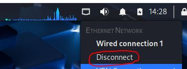
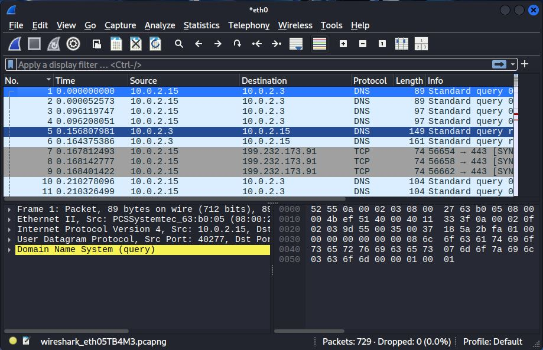
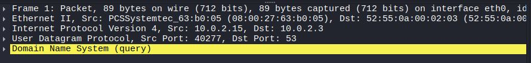
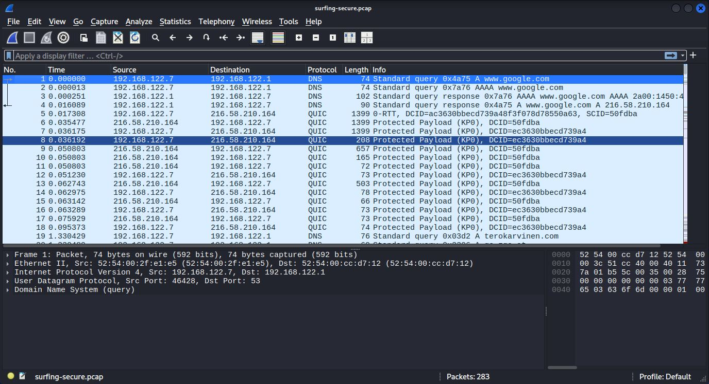
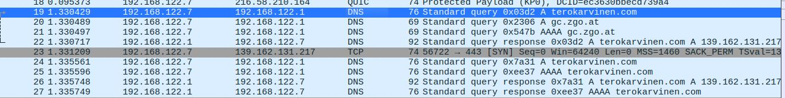
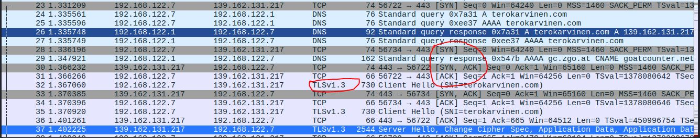

# H1 sniff
  Tehtävänanto löytyy [Tero Karvinen late spring (2026 w13-w20): Verkkoon tunkeutuminen ja tiedustelu, Läksyt](https://terokarvinen.com/verkkoon-tunkeutuminen-ja-tiedustelu/)

## x) Lue ja tiivistä.
  [Karvinen 2025: Wireshark - Getting Started](https://terokarvinen.com/wireshark-getting-started/)
  
  - Wireshark on verkkoliikenteen analysointi ohjelma
  - Wiresharkin käyttö debian distroissa voidaan sallia muillekin kuin root käyttäjille.
  - Verkkoliikenteen kaappaaminen onnistuu valitsemalla verkko-rajapinta, josta halutaan kaapata liikennettä. Kaappaus ja pysäyttäminen onnistuu vasemmasta yläkulmasta, painikkeilla.
  - Kaappaukset tallennetaan .pcap tiedostoina. Niitä voidaan analysoida jälkikäteen.
  - Statistics-valikko tarjoaa yleiskuvan (esim. hostit, liikenteen määrä ajassa, protokollat).
  - Display filtterit suodattavat esim. dns, tls, http, IP-osoitteet, portit, tekstihaku mukaan.
  - Follow TCP Stream näyttää kokonaisen yhteyden sisällön.
  
  [Karvinen 2025: Network Interface Names on Linux](https://terokarvinen.com/network-interface-linux/)
  
  - Verkkoliittymä (network interface) on kuin verkkokortti, mutta ei pakosta fyysinen kortti. Esim. localhost interface ei ole fyysinen kortti koneellasi.
  - Linux järjestelmissä verkko-rajapinnat on systemd:n nimeämiä.
    - en = langallinen Ethernet
    - wl = wlan
    - lo = loopback (localhost, 127.0.0.1)
  - Omat verkkoliittymät näet komennolla:
    ```
    ip a
    ```
  - ja reitit 
    ```
    ip route
    ```

## a) Linux. Asenna Debian tai Kali virtuaalikoneeseen.
  Minulla on jo Kali
  - kali-linux-2025.4-virtualbox-amd64
  - Debian (64-bit)
  - 2048 MB base memory
  - 2 vCPU
  - Intel NAT Network adapter
    
  [www.kali.org kali pre-built virtual machines - virtualbox](https://www.kali.org/get-kali/#kali-virtual-machines)

  Oletus selaimena käytän Firefox.

## b) Ei voi kalastaa
Katkaise ja palauta virtuaalikoneen internet yhteys.

  Virtuaalikoneen verkkoyhteys katkeaa ja yhdistyy näistä painikkeista:
  
  
  

## c) Wireshark
  Asenna Wireshark. Sieppaa liikennettä Wiresharkilla.

Wireshark asennus onnistuu seuraavalla komennolla:
```
sudo apt-get install wireshark
```
Minulla on käytössä paketti virtuaalikone, jolla on jo valmiina wireshark. Epäilen, ettei minun sen takia tarvinnut määrittää wiresharkin käyttöä ei root käyttäjille.

Nopea verkkoliikenteen kaappaus:



## d) Oikeesti TCP/IP
  Osoita TCP/IP-mallin neljä kerrosta yhdestä siepatusta paketista.

  
  
  - Ethernet II = linkkikerros, fyysinen siirto verkossa.
  - Internet protocol version 4 = internet kerros, reititys verkkojen välillä, IP-osoitteet.
  - User Datagram Protocol = kuljetuskerros, sovellusten välinen tiedonsiirto, UDP ja TCP jne.
  - Domain Name System = sovelluskerros, missä DNS ja muut sovellukset toimii.
  
## e) Mitäs tuli surffattua?
  Avaa surfing-secure.pcap. Tutustu siihen pintapuolisesti ja kuvaile, millainen kaappaus on kyseessä.

Kaappaus alkaa avaamalla yhteys google.com, jonka kautta haetaan osoitetta terokarvinen.com. Osoitteeseen tehdään kättelyt ja avataan TLS v1.3 yhteys, joka mitä ilmeisimmin on salattu HTTP eli HTTPS.
Kaappaus sisältää 283 pakettia, session pituus on 7.5 minuuttia ja tunnistin sieltä DNS, TCP, TLS ja QUIC protokollat.




TCP kättelyt:


## f) Mitä selainta käyttäjä käyttää?
En löytänyt.

## g) Minkä merkkinen verkkokortti käyttäjällä on?
En löytänyt sitä. Ethernet II kohdassa löytyy tietoa linkkikerroksen asioista, esim. MAC-osoitteet, jotka siis ovat verkkokortin osoitteita.

## h) Millä weppipalvelimella käyttäjä on surffaillut?
Info osiossa näen DNS kyselyiden kohteet, jotka ovat haettuja weppipalvelimia:
- google.com
- terokarvinen.com
- gc.zgo.at
- goatcounter.netlify.com
- commentero.terokarvinen.com

### Lähteet

https://terokarvinen.com/verkkoon-tunkeutuminen-ja-tiedustelu/

https://terokarvinen.com/wireshark-getting-started/

https://terokarvinen.com/network-interface-linux/

https://www.kali.org/get-kali/#kali-virtual-machines
