# h2 Lempiväri: violetti
Tehtävänanto löytyy [Tero Karvinen late spring (2026 w13-w20): Verkkoon tunkeutuminen ja tiedustelu, Läksyt](https://terokarvinen.com/verkkoon-tunkeutuminen-ja-tiedustelu/)
 ### Ympäristö:
  - kali-linux-2025.4-virtualbox-amd64
  - Debian (64-bit)
  - 2048 MB base memory
  - 2 vCPU
  - Intel NAT Network adapter
    
  [www.kali.org kali pre-built virtual machines - virtualbox](https://www.kali.org/get-kali/#kali-virtual-machines)

  Oletus selaimena käytän Firefox.

##  x) Lue ja vastaa lyhyesti kysymyksiin. Tässä alakohdassa x ei tällä kertaa tarvitse lukea artikkeleita kokonaan, ei tarvitse tiivistää niitä, eikä tehdä testejä koneella.
Selitä tuskan pyramidin idea 1-2 virkkeellä. Bianco 2013: Pyramid of Pain. (Katso eritoten pyramidin kuvaa.)
Selitä timanttimallin (Diamond Model) idea 1-2 virkkeellä. 
Tekijä esittelee sen aika juhlallisesti, voit myös etsiä yksinkertaisempia artikkeleita hakukoneella tai kelata suoraan timantin kuvaan. Caltagirone et al 2013: Diamond Model

[Bianco 2013: Pyramid of Pain, Update 2014-01-17](https://detect-respond.blogspot.com/2013/03/the-pyramid-of-pain.html)

Graafinen kuvaus osoittimista joita käytettäisiin hyökkääjän huomaamisessa. 
Osoittimia on paljon ja alemman tason osoittimet eivät anna kovin tarkkaa kuvaa hyökkääjästä, mutta mitä korkeammalle mennään sitä tarkempia osoittimet ovat ja sen paremmin voidaan estää hyökkääjää toimimasta.


[Caltagirone et al 2013, 9: Diamond Model](https://www.threatintel.academy/wp-content/uploads/2020/07/diamond-model.pdf)

Kuvaus siitä miten hyökkääjä etenee vaiheittain toimiessaan kohdetta vastaan, jonkin kyvykkyyden ja infrastruktuurin kautta. 
Tämä auttaa kyberturva analyysissä ymmärtämään hyökkääjän ja kohteiden välistä suhdetta. Kun hyökkääjän toimista saadaan jokin tapahtuma havaittua, sitä voidaan käyttää käännepisteenä selvittää lisää tietoa hyökkääjän toimista.

## a) Apache log. Asenna Apache-weppipalvelin paikalliselle virtuaalikoneellesi. 
Surffaa palvelimellesi salaamattomalla HTTP-yhteydellä, http://localhost . 
Etsi omaa sivulataustasi vastaava lokirivi. Analysoi yksi tällainen lokirivi, eli selitä sen kaikki kohdat. 
(Jos Apache ei ole kovin tuttu, voit tätä tehtävää varten vain asentaa sen ja testata oletusweppisivulla. 
Eli ei tarvitse tehdä omia kotisvuja tms.)

### Aloitetaan lataamalla apache2. Sitten varmistan, että apache palvelin on päällä. Seuraavaksi voidaan käydä katsomassa selaimsessa apachen oletusverkkosivua.

```
sudo apt install apache2
```
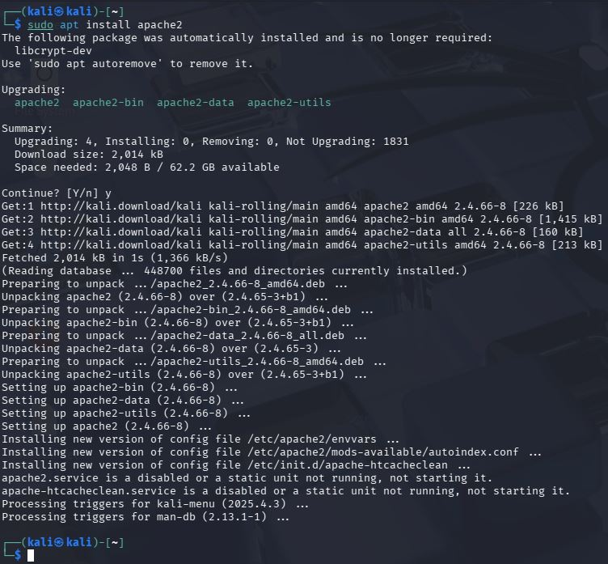

Palvelimet eivät aina käynnisty suoraan, kun ne on ladattu. En tiedä miksi näin. Apache palvelimen saa käynnistettyä komennolla:

```
sudo systemctl start apache2
```
Sitten vielä pikku muutoksella edelliseen komentoon voin tarkistaa, että palvelin on käynnissä:
```
sudo systemctl status apache2
```
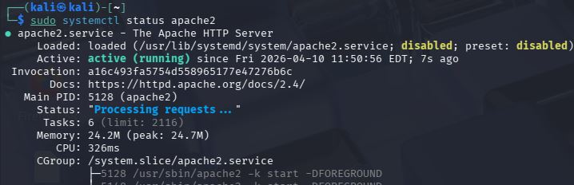

Nyt palvelin on päällä ja voin käydä katsomassa selaimella sen oletussivua. URL http://localhost/

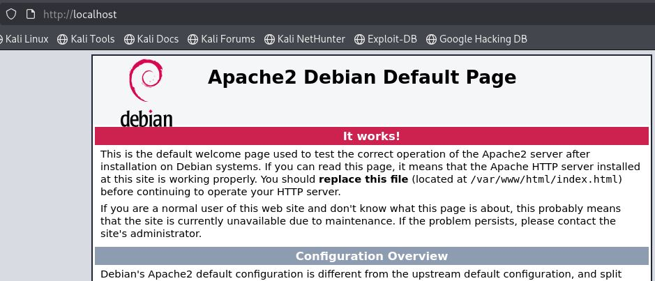

Viimeinen vaihe tässä tehtävässä on käydä katsomassa logeista sivunlataus ja analysoida yksi logi rivi.
Logit löytyvät hakemistosta /var/log/apache2/access.log [Solarwinds Loggly 2024: how to monitor your apache logs](https://www.loggly.com/use-cases/how-to-monitor-your-apache-logs/)
Katselen logeja komennolla tail, jotta näen viimeiset 10 riviä tiedostosta ja paramaetrillä -f tulostuu lisää rivejä samalla, kun tiedosto kasvaa. Tämä on mielestäni kätevää jos haluan seurata suorana, kuinka webbisivua ladataan.
```
tail -f /var/log/apache2/access.log
```
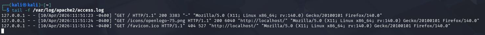
```
127.0.0.1 - - [10/Apr/2026:11:51:23 -0400] "GET / HTTP/1.1" 200 3383 "-" "Mozilla/5.0 (X11; Linux x86_64; rv:140.0) Gecko/20100101 Firefox/140.0"
```
Löysin dokumentaatiota jossa selitetään logi rivin osia. [Apache HTTP server documentation version 2.4 Log Files](https://httpd.apache.org/docs/2.4/logs.html)
- Siellä näkyy ensin client IP-osoite: 127.0.0.1
- Viivat tarkoittaa, että tietoa ei ole saatavilla: --
- Aikaleima, milloin latauspyyntö on tehty: [10/Apr/2026:11:51:23 -0400]
- Itse latauspyyntö: GET / HTTP/1.1
- Webserver statuskoodi: 200
- Vastauksen koko: 3383
- Ja lopuksi on tiedot selaimesta.


## b) Nmapped. Porttiskannaa oma weppipalvelimesi käyttäen localhost-osoitetta ja 'nmap -A' päällä. 
Selitä tulokset. (Pelkkä http-portti 80/tcp riittää)

### Porttiskannasin komennolla:
```
nmap -A localhost
```
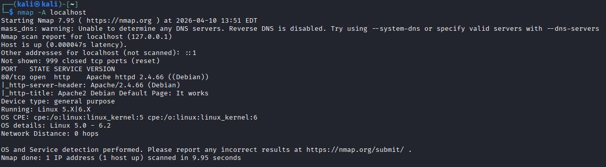

Tuloksista voi huomata, että 999 tcp-porttia oli kiinni ja vain portti 80 oli auki.
Portissa 80 pyörii http yhteys, joka kuuluu apache2 httpd 2.4.66 (Debian) palvelimelle.

## c) Skriptit. Mitkä skriptit olivat automaattisesti päällä, kun käytit "-A" parametria? 
(Näkyy avoimien porttinumeroiden alta, http-blah, http-blöh...).

- |_http-server-header: Apache/2.4.66 (Debian)
- |_http-title: Apache2 Debian Default Page: It works

Automaattisesti päällä olleet skriptit. HTTP palvelimen ylätunniste/(header), markkinoi palvelinta, kertoo esim palvelimen nimen ja version. HTTP otsikko/(title), kertoo webbisivun otsikon.


## d) Jäljet lokissa. Etsi weppipalvelimen lokeista jäljet porttiskannauksesta (NSE eli Nmap Scripting Engine -skripteistä skannauksessa). 
Löydätkö sanan "nmap" isolla tai pienellä? Selitä osumat. 
Millaisilla hauilla tai säännöillä voisit tunnistaa porttiskannauksen jostain muusta lokista, jos se on niin laaja, että et pysty lukemaan itse kaikkia rivejä?

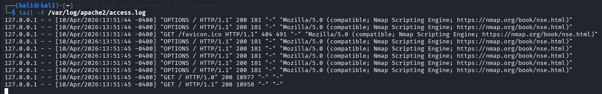

### Sieltä löytyi paljon samasta osoitteesta tulleita pyyntöjä ja melkein kaikissa lukee Nmap.
Nuo "options" pyynnöt yrittävät selvittää mitä http metodeja palvelin käyttää/sallii.

Jos access loki olisi aivan massiivinen, niin voisin rajata hakua esim. IP-osoitteen mukaan tai järjestää IP-osoitteen mukaan. Jos järjestän IP-osoitteen mukaan niin voin katsoa mistä osoitteesta on tullut eniten pyyntöjä.

```
awk '{print $1}' /var/log/apache2/access.log | sort | uniq -c | sort -nr | less
```
- awk '{print $1}' /var/log/apache2/access.log* — Poimii jokaisesta rivistä IP-osoitteen.
- sort — Lajittelee IP-osoitteet.
- uniq -c — Yhdistää samat IP-osoitteet ja laskee montako kertaa ne esiintyvät.
- sort -nr — Järjestää tuloksen: -n = numeron mukaan, -r = suurin ensin.
- less — Näyttää tulokset ruutu kerrallaan.

## e) Wire sharking. Sieppaa verkkoliikenne porttiskannatessa Wiresharkilla. 
Huomaa, että localhost käyttää "Loopback adapter" eli "lo". Tallenna pcap. Etsi kohdat, joilla on sana "nmap" ja kommentoi niitä. 
Jokaisen paketin jokaista kohtaa ei tarvitse analysoida, yleisempi tarkastelu riittää.


### Avasin wiresharkin ja valitsin loopback lo adapterin. Aloitin verkkoliikenteen sieppauksen ja ajoin terminaalista "nmap -A localhost".
Paketteja tuli kaapattua 2343.

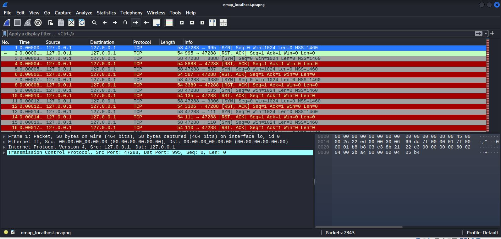

- Todella paljon [SYN] ja [RST, ACK] paketteja. Nmap yrittää muodostaa yhteyden kaikkiin portteihin.

Minua ei nyt kiinnosta sen enempää nämä tcp-kättelyt. Minua kiinnostaa enemmän paketit joissa on "nmap" sisällä. Asetin suodattimen, jolla näen http-protokollaa käsittelevän liikenteen ja rajaan sen vielä siten, että näen pelkästään paketit joissa esiintyy "nmap"
```
http contains "nmap"
```
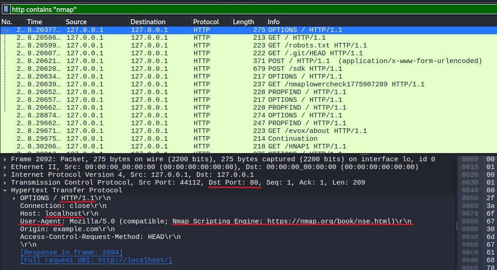

Hypertext transfer protocol:
- OPTIONS / HTTP/1.1
- Host: localhost
- User agent: Mozilla/5.0 (compatible; Nmap Scripting Engine; https://nmap.org/book/nse.html)

User agent on ohjelma, joka edustaa toimijaa. Esim. selain tai muu sovellus, joka yhdistää web-palvelimelle.[Mozilla MDN Web Docs. 2024: User agent](https://developer.mozilla.org/en-US/docs/Glossary/User_agent). Tässä tapauksessa se on siis nmap.

Ensimmäinen paketti on varmaan vain tiedustelua web-palvelimen hyväksymistä metodeista, mutta en ole aivan varma asiasta. Katsotaanpa toinen:

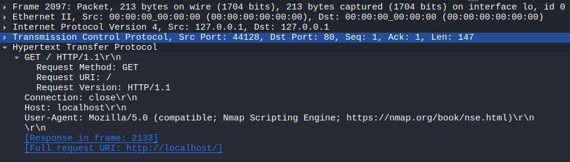

Hypertext transfer protocol:
- GET / HTTP1.1\r\n
 - Request Method: GET
 - Request URI: /
 - Request Version: HTTP/1.1
- Connection: close\r\n
- Host: localhost\r\n
- User-Agent: Mozilla/5.0 (compatible; Nmap Scripting Engine; https;//nmap.org/book/ns.html)\r\n

Eli tässä paketissa siis pyydetään jotakin palvelimelta. Veikkaisin juurihakemistoa, koska pyynnön URI on " / ".


## f) Net grep. Sieppaa verkkoliikenne 'ngrep' komennolla ja näytä kohdat, joissa on sana "nmap".

### Sieppasin "nmap -A localhost" verkkoliikennettä komennolla:
```
sudo ngrep -d lo 'nmap' -W byline port 80
```
- -d, määrittää mitä porttia kuunneellaan.
- 'nmap', suodattaa paketit joissa on 'nmap'
- -W byline, näyttää http liikennettä riveittäin.

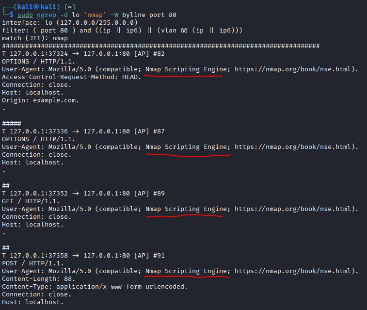


> Testaillessa ngrep:illä ajoin tämän komennon: sudo ngrep -d lo -W byline port 80.
> Tulosteessa näkyy kokonaisia html tiedoston sisältöjä ja myös apache verkkopalvelimen hakemistorakenne.
> Miten se on mahdollista? Onko se normaalia?

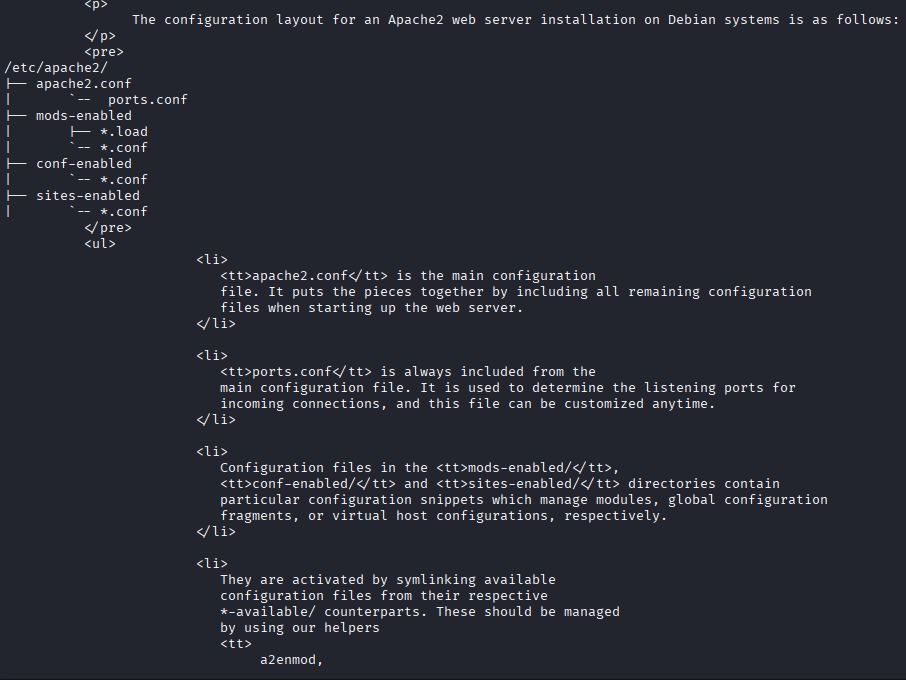


## g) Agentti. Vaihda nmap:n user-agent niin, että se näyttää tavalliselta weppiselaimelta.

### Kokeilen tätä komentoa:
```
nmap -p 80 --script=http-enum \
--script-args http.useragent="Mozilla/5.0 (Windows NT 10.0; Win64; x64) AppleWebKit/537.36 Chrome/120.0.0.0 Safari/537.36" \
localhost
```
Miten komento toimii:
- --script=http-enum, etsii hakemistoja ja tiedostoja web-palvelimella.
[Paulino Calderon 2017: Chapter 4. Scanning Web servers: Discovering interesting files and folders in web servers](https://learning.oreilly.com/library/view/nmap-network-exploration/9781786467454/2acbfab2-b917-46d8-9eb1-fa6e5b23d72e.xhtml)
- --script-args http.useragent, asettaa http-pyyntöjen user-agent otsikon.
- Mozilla/5.0 (Windows NT 10.0; Win64; x64) AppleWebKit/537.36 Chrome/120.0.0.0 Safari/537.36, on Chrome selaimen user-agent.
[Paulino Calderon 2017: Chapter 11. Setting the user agent pragmatically](https://learning.oreilly.com/library/view/nmap-network-exploration/9781786467454/62ae3cc1-af7b-4046-89c1-a6eaa6c0b759.xhtml)

Komento siis saa nmapin http-pyynnöt näyttämään chromeselaimen tekemiltä, koska user-agent on vaihdettu chrome selaimen user-agentiksi.

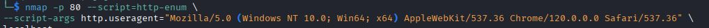


## h) Pienemmät jäljet. Porttiskannaa weppipalvelimesi uudelleen localhost-osoitteella. 
Tarkastele sekä Apachen lokia että siepattua verkkoliikennettä. 
Mikä on muuttunut, kun vaihdoit user-agent:n? Löytyykö lokista edelleen tekstijono "nmap"?


### Nyt ei näy nmap user-agenttia ollenkaan.

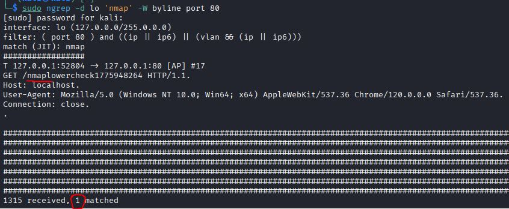

### Nyt on enää yksi paketti, jossa lukee nmap.

## i) Hieman vaikeampi: LoWeR ChEcK. Poista skritiskannauksesta viimeinenkin "nmap" -teksti. 
Etsi löytämääsi tekstiä /usr/share/nmap -hakemistosta ja korvaa se toisella. 
Tee porttiskannaus ja tarkista, että "nmap" ei näy isolla eikä pienellä kirjoitettuna Apachen lokissa eikä siepatussa verkkoliikenteessä. 
(Tässä tehtävässä voit muokata suoraan lua-skriptejä /usr/share/nmap alta, 'sudoedit'. Muokatun version paketoiminen siis rajataan ulos tehtävästä.)


## j) FCC ID. Etsi valitsemasi langattoman laitteen tiedot FCC ID:llä. 
Mitä liikenteen purkamista tai manipuloimista hyödyttävää tietoa löydät?


## Lähdeluettelo

- [Tero Karvinen late spring (2026 w13-w20): Verkkoon tunkeutuminen ja tiedustelu, Läksyt](https://terokarvinen.com/verkkoon-tunkeutuminen-ja-tiedustelu/)
- [Bianco 2013: Pyramid of Pain, Update 2014-01-17](https://detect-respond.blogspot.com/2013/03/the-pyramid-of-pain.html) (Luettu 9.4.2026)
- [Caltagirone et al 2013, 9: The Diamond Model of Intrusion Analysis](https://www.threatintel.academy/wp-content/uploads/2020/07/diamond-model.pdf) (Luettu 9.4.2026)
- [Solarwinds Loggly 2024: how to monitor your apache logs](https://www.loggly.com/use-cases/how-to-monitor-your-apache-logs/) (Luettu 10.4.2026)
- [Apache HTTP server documentation version 2.4 Log Files](https://httpd.apache.org/docs/2.4/logs.html) (Luettu 10.4.2026)
- [Mozilla MDN Web Docs. 2024: User agent](https://developer.mozilla.org/en-US/docs/Glossary/User_agent) (Luettu 11.4.2026)
- [Paulino Calderon 2017, Nmap: Network Exploration and Security Auditing Cookbook, Second Edition](https://learning.oreilly.com/library/view/nmap-network-exploration/9781786467454/)(Luettu 11.4.2026)
